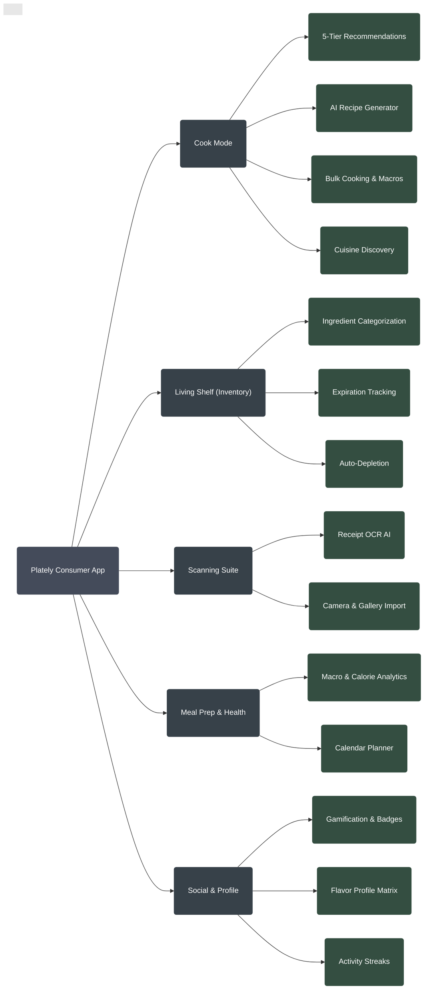

# Plately Smart Kitchen & Food Ecosystem

This document outlines the current state and existing features available in the Plately consumer app at launch.

## Flow & Detailed Feature Breakdown

### 📱 Consumer Applications (Cross-Platform)
*   **Unified Interface**
    *   Flutter-built architecture supporting iOS, Android, and Web simultaneously.
    *   Responsive design with dynamic theming and dual-mode navigation.

### 🍳 Cook Mode (Smart Cooking & AI)
*   **5-Tier Recommendation Engine** (Learning algorithm based on interaction history)
    1.  **Perfect Match:** 100% ingredient match with current Living Shelf.
    2.  **For You:** High affinity based on past likes and Flavor Profile.
    3.  **Use It Up:** Prioritizes recipes containing soon-to-expire ingredients to reduce waste.
    4.  **Almost There:** 75%+ ingredient match (suggests missing items).
    5.  **Explore:** Discovery of trending, new, and diverse recipes globally.
*   **Cuisine & Dietary Sorting**
    *   Dynamic filtering by global cuisines (Uzbek, Korean, Italian, Mexican, etc.) and dietary needs.
*   **Gemini AI Recipe Generator**
    *   *Constraint-based generation:* Creates unique recipes strictly using available ingredients.
    *   *Freeform generation:* Inspires new ideas regardless of current inventory.
*   **Bulk Cooking & Meal Prep Engine**
    *   Input target days and meals/day.
    *   Target macro-nutrient optimization (custom calorie and protein goals).
*   **Recipe Execution**
    *   Interactive, step-by-step cooking interface with ingredient portioning.

### 🥫 Living Shelf (Inventory Management)
*   **Smart Ingredient Tracking**
    *   Categorized storage structures (Produce, Meat, Dairy, Pantry, Spices, etc.).
    *   Visual expiration monitoring with color-coded freshness indicators.
*   **Automated Lifecycle**
    *   Auto-depletion of ingredients from the shelf upon cooking a recipe.
*   **Manual & Quick Management**
    *   Add, edit, delete functionality with smart emoji/icon pairing.

### 📸 Scanning Suite
*   **AI Receipt Parsing**
    *   Camera integration for real-time scanning of grocery receipts.
    *   Gallery import for digital receipts.
    *   Automated OCR text extraction, parsed by AI into structured Living Shelf items.

### 🥗 Meal Prep & Health Analytics
*   **Nutrition Tracking**
    *   Detailed macro-nutrient breakdowns (Protein, Carbs, Fats).
    *   Caloric tracking against user health goals.
*   **Calendar & Scheduling**
    *   Weekly calendar view for scheduled meals.
    *   Prep-day optimization and batch cooking schedules.

### 👤 Social & User Profile
*   **Gamification & Rewards Engine**
    *   Activity streaks and dynamic point accumulation.
    *   Unlockable achievements and badges (e.g., Novice Chef, AI Master, Wok Star).
    *   Tier progression leveling system.
*   **Flavor Profile Analytics**
    *   Taste mapping analytics (Spicy, Sweet, Savory, Sour preferences).
    *   Ingredient diversity scoring.
    *   Cooking habits and frequency dashboard.

---

## Consumer App Mindmap

