# Plately Smart Kitchen Ecosystem

This document reflects the exact feature set currently available in the Plately consumer app across the 4 primary launch tabs, alongside the broader strategic vision for the platform.

## Flow & Detailed Feature Breakdown

### 📱 Consumer App (Existing Features)

*   **🍳 Cook Mode**
    *   **5-Tier Recommendation Engine:** Tailored algorithms for *Perfect Match*, *For You*, *Use It Up*, *Almost There*, and *Explore*.
    *   **Gemini AI Recipe Generator:** Generates recipes strictly from inventory constraints or entirely freeform.
    *   **Cuisine Discovery & Sorting:** Dynamic filtering by global cuisines.
    *   **Interactive Recipe Execution:** Step-by-step cooking interface with automated ingredient portioning.
    *   **Vertical Recipe Feeds:** Swipeable video-style feeds for recipe discovery.
    *   **Post-Cook Rewards:** Gamified XP drops upon completing a cooking session.

*   **🥫 Shelf (Living Shelf)**
    *   **Smart Ingredient Tracking:** Categorized storage (Produce, Meat, Dairy, Pantry, etc.) with visual expiration monitoring.
    *   **Automated Lifecycle:** Auto-depletion of ingredients from the shelf upon finishing a recipe.
    *   **Manual Management:** Add, edit, and delete functionality with smart icon/emoji pairing.

*   **📸 Scanning Suite**
    *   **AI Receipt Parsing:** Extracts and categorizes items from grocery receipts via camera or gallery import.
    *   **Live Barcode Scanner:** Real-time UPC barcode scanning for instant item identification.
    *   **Food Photo Recognition:** Direct AI recognition of loose ingredients (e.g., loose vegetables).
    *   **Audit Flow:** Manual review screen to confirm or correct AI-extracted items before adding to the shelf.

*   **👤 Profile (Health & Social)**
    *   **Gamification Dashboard:** Visual XP progress, level progression, activity streaks, and unlockable badges.
    *   **Flavor Profile Analytics:** Radar matrix plotting taste preferences (Sweet, Salty, Sour, Bitter, Umami, Spicy).
    *   **Nutrition Tracker:** Macro-nutrient and caloric tracking against user health goals.
    *   **Meal Planner:** 7-day calendar view for scheduling upcoming recipes.
    *   **Smart Shopping List:** Interactive checklist that auto-syncs across devices.
    *   **Social & Creator Hub:** Follower tracking, user-generated post uploads, and creator/restaurant dashboards.

### 🌐 Vision (Future Strategy)

*   **Version 1 (Pre-Launch, Beta Iteration & Funding Strategy):**
    *   **Phase 1: Showcase & Advertise:** Delay public launch. Focus entirely on advertising and showcasing the deeply built current features to generate hype.
    *   **Phase 2: Prototype Furthest Milestones:** Fork into a new GitHub branch to rapidly build out the furthest possible technical milestones. The goal is to perfectly showcase the *flow* and vision to investors and early adopters.
    *   **Phase 3: Beta Signups & Investment:** Leverage the showcase to capture massive beta sign-ups and secure multi-million dollar seed investment.
    *   **Phase 4: Beta Iteration to Perfection:** Work closely with beta testers to iteratively refine and fix the app until the UX and features are flawlessly perfect for the official public launch.
    *   **Phase 5: Massive Recipe Database:** Build and ingest a highly usable, structured recipe database containing tens of thousands of actual recipes ready for launch.
    *   **Phase 6: Seamless Grocery Integration:** Integrate with online grocery delivery stores natively, allowing users to instantly order missing ingredients directly from a recipe, flawlessly interacting with the Living Shelf.
*   **Version 2 (Social, Analytics & Creator Monetization):**
    *   **Feeds & Socialization:** A dedicated feeds section featuring video content, interactive chat, and community social engagement.
    *   **Profile & Creator Analytics:** Deep, data-driven analytics within user profiles (tracking flavor profiles, nutritional impact, and meal habits), alongside a dedicated **Creator Studio** providing advanced metrics on recipe engagement, follower growth, and monetization for creators.
    *   **Creator Marketplace:** Premium recipes created by top chefs/creators, which can be purchased by users, opening a monetization channel for the community.
*   **Version 3 (Mobile POS, Booking & Restaurant SaaS):**
    *   **Architecture Shift & Second Tab:** Introduction of a fundamentally new architecture to unlock the currently hidden "Ordering" tab (the codebase foundation for this already exists).
    *   **Business Creator (Restaurant SaaS):** A "Shopify for Restaurants" suite where eating place owners can easily spin up their own custom in-app websites and use AI to automatically manage their social media presence.
    *   **In-App Ordering, Payments & Seat Booking:** Plately manages the entire transaction layer, functioning as a mobile POS (similar to modern digital-only cafes). Users can order their food, pay digitally, and book seats directly through the app without external platforms.
*   **Version 4 (Full Vertical Integration & Hardware):**
    *   **Full-In Ordering Ecosystem:** Scaling the ordering architecture to handle complete, end-to-end logistics for both diners and restaurants.
    *   **Shared Delivery Network (Fleet App):** Launching a dedicated courier fleet application to power a shared, optimized delivery network for all contracted eating places.
    *   **Self-Service Kiosk Hardware:** Deploying proprietary physical ordering kiosks to partnered restaurants, perfectly syncing their physical storefront operations with the Plately digital ecosystem.

---

## Ecosystem Map

```mermaid
flowchart LR
    %% Styling to match the dark aesthetic
    classDef root fill:#444b5a,color:#fff,stroke:none,rx:5,ry:5,padding:20px;
    classDef level1 fill:#374149,color:#fff,stroke:none,rx:5,ry:5;
    classDef level2 fill:#374149,color:#fff,stroke:none,rx:5,ry:5;
    classDef level3 fill:#344e41,color:#fff,stroke:none,rx:5,ry:5;
    classDef level4 fill:#2d4036,color:#fff,stroke:none,rx:5,ry:5;
    classDef level5 fill:#233329,color:#fff,stroke:none,rx:5,ry:5;

    Root["Plately"]:::root

    %% Level 1
    Root --> App["Consumer App"]:::level1
    Root --> Vision["Vision"]:::level1

    %% ==========================================
    %% CONSUMER APP BRANCH (Deeply Detailed)
    %% ==========================================
    
    %% Level 2 - App Modules
    App --> Cook["Cook Mode"]:::level2
    App --> Shelf["Living Shelf"]:::level2
    App --> Scan["Scanning Suite"]:::level2
    App --> Profile["Social & Profile"]:::level2

    %% ------------------------------------------
    %% COOK MODE (Levels 3, 4, 5)
    %% ------------------------------------------
    Cook --> CookDisc["Recipe Discovery"]:::level3
    CookDisc --> Tiers["5 Match Tiers"]:::level4
    Tiers --> T1["Perfect (100% Match)"]:::level5
    Tiers --> T2["For You (AI Pick)"]:::level5
    Tiers --> T3["Use It Up (Expiring)"]:::level5
    Tiers --> T4["Almost (Missing 1-2)"]:::level5
    Tiers --> T5["Explore (All)"]:::level5
    
    CookDisc --> AIGen["AI Recipe Generator"]:::level4
    AIGen --> Constraint["Inventory Constrained"]:::level5
    AIGen --> Freeform["Freeform Generation"]:::level5

    CookDisc --> CookFeed["Video Recipe Feeds"]:::level4

    Cook --> CookRun["Active Cooking Execution"]:::level3
    CookRun --> CSteps["Interactive Steps"]:::level4
    CookRun --> CTimer["Visual Step Timer"]:::level4
    CookRun --> CAssist["AI Chat Assistant"]:::level4
    CookRun --> CMini["Floating Mini-Player"]:::level4

    Cook --> CookPost["Post-Cook Flow"]:::level3
    CookPost --> CReward["Gamified Rewards (XP)"]:::level4
    CookPost --> CPortion["Portions Logging Sheet"]:::level4
    CPortion --> LogEat["Log Eaten Macros"]:::level5
    CPortion --> StoreLeft["Store Leftovers to Shelf"]:::level5

    Cook --> CookBulk["Bulk Meal Prep"]:::level3
    CookBulk --> PrepPlan["Multi-Day Plan Sheet"]:::level4
    CookBulk --> PrepShop["Aggregated Batch Shopping"]:::level4

    %% ------------------------------------------
    %% SHELF MODE (Levels 3, 4, 5)
    %% ------------------------------------------
    Shelf --> SZone["Zone Tracking"]:::level3
    SZone --> ZFridge["Fridge"]:::level4
    SZone --> ZFreezer["Freezer"]:::level4
    SZone --> ZPantry["Pantry"]:::level4

    Shelf --> SFresh["Freshness System"]:::level3
    SFresh --> FPredict["AI Expiry Predictions"]:::level4
    SFresh --> FPulse["Visual Urgency Pulses"]:::level4

    Shelf --> SAction["Inventory Actions"]:::level3
    SAction --> SSwipeR["Swipe Right (Consume)"]:::level4
    SSwipeR --> SLogMac["Logs Macros to Diary"]:::level5
    SAction --> SSwipeL["Swipe Left (Discard)"]:::level4
    SAction --> SMan["Manual Detail Editor"]:::level4

    %% ------------------------------------------
    %% SCAN SUITE (Levels 3, 4, 5)
    %% ------------------------------------------
    Scan --> ScanMode["Scan Modes"]:::level3
    ScanMode --> MRec["AI Receipt Parsing (OCR)"]:::level4
    ScanMode --> MPhoto["Loose Food Photo Recognition"]:::level4
    ScanMode --> MBar["Live Barcode Scanner"]:::level4
    ScanMode --> MCal["Visual Plate Calorie Scanner"]:::level4

    Scan --> ScanAud["Audit Flow"]:::level3
    ScanAud --> AConf["Confidence Indicators"]:::level4
    ScanAud --> AEdit["Manual Correction"]:::level4
    ScanAud --> ABulk["Bulk Add to Shelf"]:::level4

    %% ------------------------------------------
    %% PROFILE MODE (Levels 3, 4, 5)
    %% ------------------------------------------
    Profile --> PGam["Gamification"]:::level3
    PGam --> GProg["XP & Level Progress"]:::level4
    PGam --> GBadge["Unlockable Badges"]:::level4
    PGam --> GStreak["Cooking Streaks"]:::level4

    Profile --> PHealth["Health & Diet"]:::level3
    PHealth --> HFlav["Flavor Profile Radar Matrix"]:::level4
    PHealth --> HNut["Macro & Nutrition Tracker"]:::level4
    PHealth --> HPlan["7-Day Calendar Meal Planner"]:::level4
    PHealth --> HShop["Smart Syncing Shopping List"]:::level4

    Profile --> PSoc["Social Hub"]:::level3
    PSoc --> SFeed["Community Feed"]:::level4
    PSoc --> SCreate["Creator Dashboard"]:::level4

    %% ==========================================
    %% VISION BRANCH (Roadmap)
    %% ==========================================
    Vision --> V1["Version 1 (Pre-Launch)"]:::level2
    Vision --> V2["Version 2 (Creator & Social)"]:::level2
    Vision --> V3["Version 3 (Restaurant SaaS)"]:::level2
    Vision --> V4["Version 4 (Hardware & Fleet)"]:::level2

    %% Level 3, 4, 5 - Version 1
    V1 --> V1Beta["Showcase & Beta Iteration"]:::level3
    V1Beta --> LocalAI["Local Private AI (Ollama)"]:::level4
    LocalAI --> NoLat["Zero Latency Generation"]:::level5
    V1 --> V1Db["Massive Recipe Database"]:::level3
    V1Db --> SixSig["6-Signal Recommendation Engine"]:::level4
    SixSig --> ExFlavor["Expiry, Flavor, Inventory Vectors"]:::level5
    V1 --> V1Groc["Seamless Grocery Delivery"]:::level3
    V1Groc --> CartAPI["Supermarket APIs"]:::level4
    CartAPI --> AutoCart["Auto-Cart Missing Items"]:::level5

    %% Level 3, 4, 5 - Version 2
    V2 --> V2Feed["Social Video Feeds"]:::level3
    V2Feed --> VertVideo["TikTok-style Shorts"]:::level4
    VertVideo --> OrderNow["Direct 'Order Now' Overlays"]:::level5
    V2 --> V2Ana["Creator Studio Analytics"]:::level3
    V2Ana --> MetDash["Advanced Metrics Dashboard"]:::level4
    MetDash --> RevEng["Revenue & Follower Tracking"]:::level5
    V2 --> V2Market["Premium Recipe Marketplace"]:::level3
    V2Market --> PayWall["Monetized Chef Content"]:::level4
    PayWall --> MicroTx["Micro-transaction Layer"]:::level5

    %% Level 3, 4, 5 - Version 3
    V3 --> V3POS["Mobile POS & Payments"]:::level3
    V3POS --> LivePOS["Live Restaurant Dashboard"]:::level4
    LivePOS --> WSSync["Real-Time WebSocket Sync"]:::level5
    V3 --> V3SaaS["Restaurant SaaS Websites"]:::level3
    V3SaaS --> WhiteLab["White-Label Sites"]:::level4
    WhiteLab --> AIMark["AI Social Media Manager"]:::level5
    V3 --> V3Book["Seat Booking System"]:::level3
    V3Book --> PayGate["Payment Integration"]:::level4
    PayGate --> StripeLoc["Stripe / Local Gateways"]:::level5

    %% Level 3, 4, 5 - Version 4
    V4 --> V4Log["Full Logistics Ecosystem"]:::level3
    V4Log --> DispAI["Dispatch AI"]:::level4
    DispAI --> RouteETA["Optimal Routing & ETA"]:::level5
    V4 --> V4Fleet["Delivery Fleet App"]:::level3
    V4Fleet --> DriverApp["Standalone Driver App"]:::level4
    DriverApp --> FlatFee["Flat-Fee Shared Network"]:::level5
    V4 --> V4Kiosk["Self-Service Kiosk Hardware"]:::level3
    V4Kiosk --> TouchHW["Touchscreen Kiosks"]:::level4
    TouchHW --> KDSPrint["KDS & Receipt Printers"]:::level5
```

