# Plately Ecosystem

This document outlines the current state of the Plately consumer app alongside our future vision.

## Flow & Detailed Feature Breakdown

### 📱 Consumer App (Existing Features)
*   **Cook Mode (Smart Cooking & AI)**
    *   **5-Tier Recommendation Engine:** Perfect Match, For You, Use It Up, Almost There, Explore.
    *   **Cuisine & Dietary Sorting:** Dynamic filtering by global cuisines and dietary needs.
    *   **Gemini AI Recipe Generator:** Constraint-based (inventory) and Freeform generation.
    *   **Bulk Cooking & Meal Prep Engine:** Target macro-nutrient optimization.
*   **Living Shelf (Inventory Management)**
    *   **Smart Ingredient Tracking:** Categorized storage with visual expiration monitoring.
    *   **Automated Lifecycle:** Auto-depletion upon cooking.
    *   **Manual Management:** Add, edit, delete with smart icons.
*   **Scanning Suite**
    *   **AI Receipt Parsing:** Camera integration and gallery import for automated OCR text extraction.
*   **Meal Prep & Health Analytics**
    *   **Nutrition Tracking:** Detailed macro-nutrient breakdowns and caloric tracking.
    *   **Calendar & Scheduling:** Weekly calendar view for scheduled meals.
*   **Social & User Profile**
    *   **Gamification & Rewards Engine:** Activity streaks, points, and unlockable badges.
    *   **Flavor Profile Analytics:** Taste mapping analytics and ingredient diversity scoring.

### 🌐 Vision (Future Strategy)
*   **Smart Kitchen IoT**
    *   Smart Fridge camera integration to auto-update the Living Shelf.
    *   Smart Scale and Smart Oven connectivity for precision cooking.
*   **Hyper-Personalization**
    *   AI Dietitian for automated health goal coaching.
    *   Family and household account sharing (shared Living Shelves).
*   **Order Mode & Commerce**
    *   Auto-cart generation for grocery delivery (Instacart, Whole Foods).
    *   Local restaurant discovery tailored by AI Flavor Profile.

---

## Ecosystem Map

```mermaid
flowchart TD
    %% Styling to match the dark aesthetic
    classDef root fill:#444b5a,color:#fff,stroke:none,rx:5,ry:5,padding:20px;
    classDef level1 fill:#374149,color:#fff,stroke:none,rx:5,ry:5;
    classDef level2 fill:#374149,color:#fff,stroke:none,rx:5,ry:5;
    classDef level3 fill:#344e41,color:#fff,stroke:none,rx:5,ry:5;

    Root["Plately"]:::root

    %% Level 1
    Root --> App["Consumer App"]:::level1
    Root --> Vision["Vision"]:::level1

    %% Level 2 - App Modules
    App --> Cook["Cook Mode"]:::level2
    App --> Shelf["Living Shelf"]:::level2
    App --> Scan["Scanning Suite"]:::level2
    App --> Prep["Meal Prep & Health"]:::level2
    App --> Social["Social & Profile"]:::level2

    %% Level 3 - Cook
    Cook --> Rec["5-Tier Recommendations"]:::level3
    Cook --> Gen["AI Recipe Generator"]:::level3
    Cook --> Bulk["Bulk Cooking & Macros"]:::level3
    Cook --> Cuis["Cuisine Discovery"]:::level3

    %% Level 3 - Shelf
    Shelf --> Cat["Ingredient Categorization"]:::level3
    Shelf --> Exp["Expiration Tracking"]:::level3
    Shelf --> Dep["Auto-Depletion"]:::level3

    %% Level 3 - Scan
    Scan --> Ocr["Receipt OCR AI"]:::level3
    Scan --> Cam["Camera & Gallery Import"]:::level3

    %% Level 3 - Prep
    Prep --> Mac["Macro Analytics"]:::level3
    Prep --> Cal["Calendar Planner"]:::level3

    %% Level 3 - Social
    Social --> Gam["Gamification & Badges"]:::level3
    Social --> Fla["Flavor Profile"]:::level3
    Social --> Str["Activity Streaks"]:::level3

    %% Level 2 - Vision
    Vision --> IoT["Smart Kitchen IoT"]:::level2
    Vision --> Hyper["Hyper-Personalization"]:::level2
    Vision --> Order["Order Mode & Commerce"]:::level2

    %% Level 3 - Vision -> IoT
    IoT --> Fridge["Smart Fridge Integration"]:::level3
    IoT --> Scale["Smart Scale Connectivity"]:::level3

    %% Level 3 - Vision -> Hyper
    Hyper --> Diet["AI Dietitian"]:::level3
    Hyper --> Fam["Family Account Sharing"]:::level3

    %% Level 3 - Vision -> Order
    Order --> Cart["Grocery Auto-Cart"]:::level3
    Order --> Res["Restaurant Discovery"]:::level3
```

