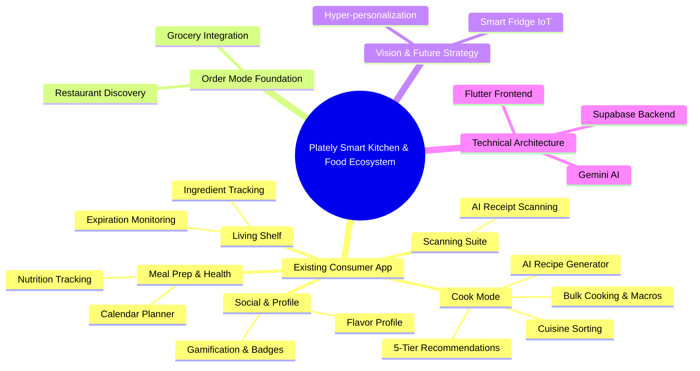

# Plately Smart Kitchen & Food Ecosystem

This document outlines the current state and future vision of the Plately ecosystem.

## Flow & Feature Breakdown

### Existing Features

*   **Cook Mode (AI Cooking)**
    1.  **5 Tier recommendation system.**
        *   **Tabs: Perfect / For You / Use It Up / Almost / Explore** which are all tailored to user's specific needs and their interaction history. This system has an algorithm that learns and improves the more a person uses.
            *   **Perfect** for 100% matching ingredients.
            *   **For you** is for recipes that you usually like or might like.
            *   **Use It Up** is for expiring ingredients.
            *   **Almost** is 75% ingredients matching.
            *   **Explore** doesn't matter. New recipes, trending recipes and etc.
        *   **Cuisines sorting**. For sorting the cuisines with countries and food type.
    2.  **Search recipes**. Helps to search the recipes.
    3.  **AI recipe generator**
        *   Generating recipe with or without your existing ingredients.
            *   With ingredients...
            *   Without...
        *   Bulk cooking
            *   Days
            *   Meals/Day
            *   Target Macros

*   **Living Shelf (Inventory)**
    1.  **Smart Ingredient Tracking**
        *   Categorized storage (Produce, Meat, Dairy, Pantry, etc.)
        *   Visual expiration monitoring and freshness indicators
    2.  **Inventory Management**
        *   Manual add, edit, and delete functionality
        *   Real-time synchronization across devices

*   **Scanning Suite**
    1.  **AI Receipt Scanner**
        *   Camera integration for real-time scanning
        *   Gallery import for existing receipt images
        *   Automated text extraction and parsing into structured shelf items

*   **Meal Prep & Health**
    1.  **Nutrition Tracking**
        *   Macro-nutrient breakdowns (Protein, Carbs, Fats)
        *   Caloric tracking and health insights
    2.  **Calendar Planner**
        *   Scheduled meals overview
        *   Future meal preparation scheduling

*   **Social & Profile**
    1.  **Gamification & Rewards**
        *   Activity streaks and earned points
        *   Unlockable badges (e.g., Novice Chef, AI Master, Wok Star)
    2.  **Flavor Profile Analytics**
        *   Taste preferences breakdown (Spicy, Sweet, Savory, etc.)
        *   Personalized cooking stats and ingredient diversity tracking

*   **Order Mode Foundation**
    1.  **Restaurant & Grocery Integration**
        *   Seamless transition from cooking to ordering ingredients
        *   Ecosystem expansion foundation

---

## Ecosystem Mindmap

