# Plately Smart Kitchen Ecosystem

This document reflects the exact feature set currently available in the Plately consumer app across the 4 primary launch tabs, alongside the broader strategic vision for the platform.

## Flow & Detailed Feature Breakdown

### 📱 Consumer App (Existing Features)

*   **🍳 Cook Mode**
    *   **5-Tier Recommendation Engine:** Tailored algorithms for *Perfect Match*, *For You*, *Use It Up*, *Almost There*, and *Explore*.
    *   **Gemini AI Recipe Generator:** Generates recipes strictly from inventory constraints or entirely freeform.
    *   **Cuisine Discovery & Sorting:** Dynamic filtering by global cuisines.
    *   **Interactive Recipe Execution:** Step-by-step cooking interface with automated ingredient portioning.
    *   **Vertical Recipe Feeds:** Swipeable video-style feeds for recipe discovery.
    *   **Post-Cook Rewards:** Gamified XP drops upon completing a cooking session.

*   **🥫 Shelf (Living Shelf)**
    *   **Smart Ingredient Tracking:** Categorized storage (Produce, Meat, Dairy, Pantry, etc.) with visual expiration monitoring.
    *   **Automated Lifecycle:** Auto-depletion of ingredients from the shelf upon finishing a recipe.
    *   **Manual Management:** Add, edit, and delete functionality with smart icon/emoji pairing.

*   **📸 Scanning Suite**
    *   **AI Receipt Parsing:** Extracts and categorizes items from grocery receipts via camera or gallery import.
    *   **Live Barcode Scanner:** Real-time UPC barcode scanning for instant item identification.
    *   **Food Photo Recognition:** Direct AI recognition of loose ingredients (e.g., loose vegetables).
    *   **Audit Flow:** Manual review screen to confirm or correct AI-extracted items before adding to the shelf.

*   **👤 Profile (Health & Social)**
    *   **Gamification Dashboard:** Visual XP progress, level progression, activity streaks, and unlockable badges.
    *   **Flavor Profile Analytics:** Radar matrix plotting taste preferences (Sweet, Salty, Sour, Bitter, Umami, Spicy).
    *   **Nutrition Tracker:** Macro-nutrient and caloric tracking against user health goals.
    *   **Meal Planner:** 7-day calendar view for scheduling upcoming recipes.
    *   **Smart Shopping List:** Interactive checklist that auto-syncs across devices.
    *   **Social & Creator Hub:** Follower tracking, user-generated post uploads, and creator/restaurant dashboards.

### 🌐 Vision (Future Strategy)

*   **Smart Kitchen IoT**
    *   **Smart Fridge Integration:** Camera integration to auto-update the Living Shelf passively.
    *   **Smart Scale Connectivity:** Precision measuring paired directly with Cook Mode instructions.
*   **Hyper-Personalization**
    *   **AI Dietitian:** Automated health goal coaching and macro adherence.
    *   **Family Account Sharing:** Shared Living Shelves and aggregated household flavor profiles.
*   **Order Mode & Commerce**
    *   **Grocery Auto-Cart:** Instantly push missing ingredients to delivery APIs (Instacart, Whole Foods).
    *   **Restaurant Discovery:** Local dining recommendations tailored by the user's AI Flavor Profile.

---

## Ecosystem Map

```mermaid
flowchart LR
    %% Styling to match the dark aesthetic
    classDef root fill:#444b5a,color:#fff,stroke:none,rx:5,ry:5,padding:20px;
    classDef level1 fill:#374149,color:#fff,stroke:none,rx:5,ry:5;
    classDef level2 fill:#374149,color:#fff,stroke:none,rx:5,ry:5;
    classDef level3 fill:#344e41,color:#fff,stroke:none,rx:5,ry:5;
    classDef level4 fill:#2d4036,color:#fff,stroke:none,rx:5,ry:5;
    classDef level5 fill:#233329,color:#fff,stroke:none,rx:5,ry:5;

    Root["Plately"]:::root

    %% Level 1
    Root --> App["Consumer App"]:::level1
    Root --> Vision["Vision"]:::level1

    %% ==========================================
    %% CONSUMER APP BRANCH (Deeply Detailed)
    %% ==========================================
    
    %% Level 2 - App Modules
    App --> Cook["Cook Mode"]:::level2
    App --> Shelf["Living Shelf"]:::level2
    App --> Scan["Scanning Suite"]:::level2
    App --> Profile["Social & Profile"]:::level2

    %% ------------------------------------------
    %% COOK MODE (Levels 3, 4, 5)
    %% ------------------------------------------
    Cook --> CookDisc["Recipe Discovery"]:::level3
    CookDisc --> Tiers["5 Match Tiers"]:::level4
    Tiers --> T1["Perfect (100% Match)"]:::level5
    Tiers --> T2["For You (AI Pick)"]:::level5
    Tiers --> T3["Use It Up (Expiring)"]:::level5
    Tiers --> T4["Almost (Missing 1-2)"]:::level5
    Tiers --> T5["Explore (All)"]:::level5
    
    CookDisc --> AIGen["AI Recipe Generator"]:::level4
    AIGen --> Constraint["Inventory Constrained"]:::level5
    AIGen --> Freeform["Freeform Generation"]:::level5

    CookDisc --> CookFeed["Video Recipe Feeds"]:::level4

    Cook --> CookRun["Active Cooking Execution"]:::level3
    CookRun --> CSteps["Interactive Steps"]:::level4
    CookRun --> CTimer["Visual Step Timer"]:::level4
    CookRun --> CAssist["AI Chat Assistant"]:::level4
    CookRun --> CMini["Floating Mini-Player"]:::level4

    Cook --> CookPost["Post-Cook Flow"]:::level3
    CookPost --> CReward["Gamified Rewards (XP)"]:::level4
    CookPost --> CPortion["Portions Logging Sheet"]:::level4
    CPortion --> LogEat["Log Eaten Macros"]:::level5
    CPortion --> StoreLeft["Store Leftovers to Shelf"]:::level5

    Cook --> CookBulk["Bulk Meal Prep"]:::level3
    CookBulk --> PrepPlan["Multi-Day Plan Sheet"]:::level4
    CookBulk --> PrepShop["Aggregated Batch Shopping"]:::level4

    %% ------------------------------------------
    %% SHELF MODE (Levels 3, 4, 5)
    %% ------------------------------------------
    Shelf --> SZone["Zone Tracking"]:::level3
    SZone --> ZFridge["Fridge"]:::level4
    SZone --> ZFreezer["Freezer"]:::level4
    SZone --> ZPantry["Pantry"]:::level4

    Shelf --> SFresh["Freshness System"]:::level3
    SFresh --> FPredict["AI Expiry Predictions"]:::level4
    SFresh --> FPulse["Visual Urgency Pulses"]:::level4

    Shelf --> SAction["Inventory Actions"]:::level3
    SAction --> SSwipeR["Swipe Right (Consume)"]:::level4
    SSwipeR --> SLogMac["Logs Macros to Diary"]:::level5
    SAction --> SSwipeL["Swipe Left (Discard)"]:::level4
    SAction --> SMan["Manual Detail Editor"]:::level4

    %% ------------------------------------------
    %% SCAN SUITE (Levels 3, 4, 5)
    %% ------------------------------------------
    Scan --> ScanMode["Scan Modes"]:::level3
    ScanMode --> MRec["AI Receipt Parsing (OCR)"]:::level4
    ScanMode --> MPhoto["Loose Food Photo Recognition"]:::level4
    ScanMode --> MBar["Live Barcode Scanner"]:::level4
    ScanMode --> MCal["Visual Plate Calorie Scanner"]:::level4

    Scan --> ScanAud["Audit Flow"]:::level3
    ScanAud --> AConf["Confidence Indicators"]:::level4
    ScanAud --> AEdit["Manual Correction"]:::level4
    ScanAud --> ABulk["Bulk Add to Shelf"]:::level4

    %% ------------------------------------------
    %% PROFILE MODE (Levels 3, 4, 5)
    %% ------------------------------------------
    Profile --> PGam["Gamification"]:::level3
    PGam --> GProg["XP & Level Progress"]:::level4
    PGam --> GBadge["Unlockable Badges"]:::level4
    PGam --> GStreak["Cooking Streaks"]:::level4

    Profile --> PHealth["Health & Diet"]:::level3
    PHealth --> HFlav["Flavor Profile Radar Matrix"]:::level4
    PHealth --> HNut["Macro & Nutrition Tracker"]:::level4
    PHealth --> HPlan["7-Day Calendar Meal Planner"]:::level4
    PHealth --> HShop["Smart Syncing Shopping List"]:::level4

    Profile --> PSoc["Social Hub"]:::level3
    PSoc --> SFeed["Community Feed"]:::level4
    PSoc --> SCreate["Creator Dashboard"]:::level4

    %% ==========================================
    %% VISION BRANCH (Levels 2, 3)
    %% ==========================================
    Vision --> IoT["Smart Kitchen IoT"]:::level2
    Vision --> Hyper["Hyper-Personalization"]:::level2
    Vision --> Order["Order Mode & Commerce"]:::level2

    IoT --> Fridge["Smart Fridge Integration"]:::level3
    IoT --> Scale["Smart Scale Connectivity"]:::level3

    Hyper --> Diet["AI Dietitian"]:::level3
    Hyper --> Fam["Family Account Sharing"]:::level3

    Order --> Cart["Grocery Auto-Cart"]:::level3
    Order --> Res["Restaurant Discovery"]:::level3
```

