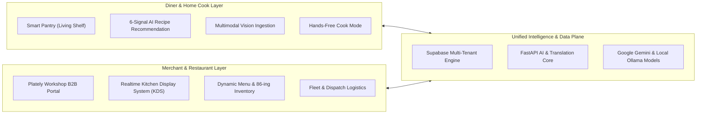
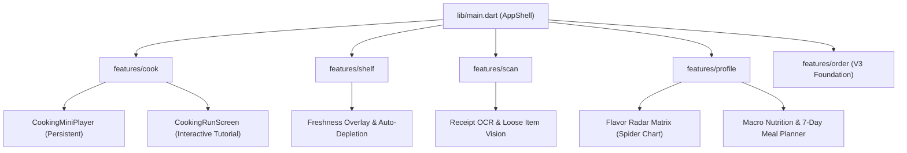
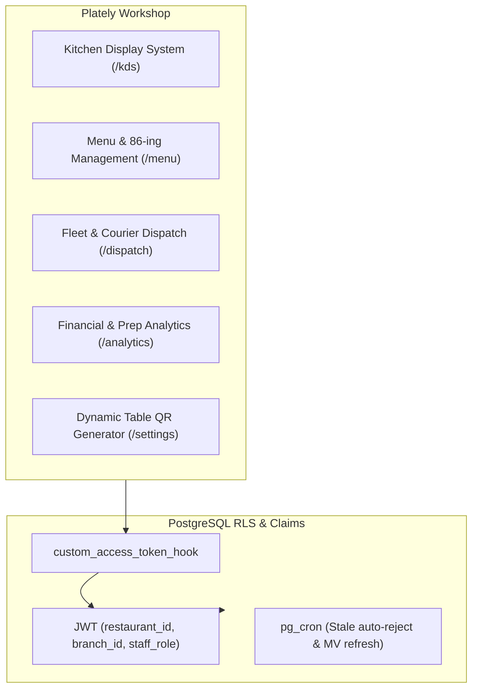
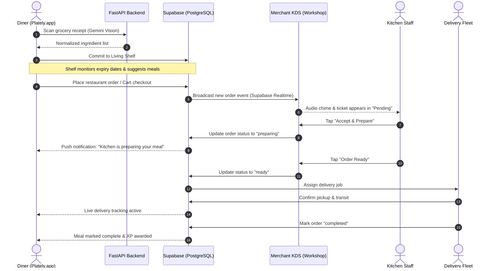
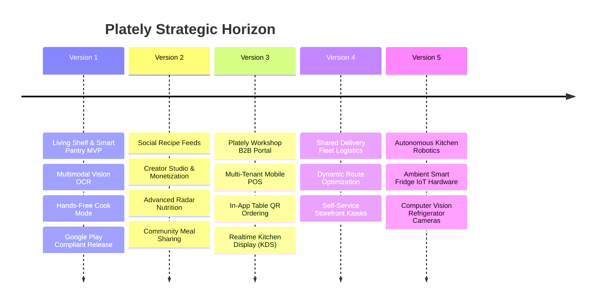

# 🍽️ Plately Ecosystem — Comprehensive Architecture & Technical Blueprint

> **Complete architectural breakdown of the Plately smart kitchen, merchant commerce, and food intelligence platform.**  
> *Last updated: October 2026 | System Version: v0.1.14 / Workshop v0.2.0*

---

## 1. Executive Overview & Value Proposition

**Plately** is a vertically integrated culinary and restaurant operating system designed to bridge consumer kitchen management with B2B restaurant commerce. Originally conceived as an inventory tracker, Plately has evolved into a two-sided network:


```mermaid
graph LR
    subgraph Diners["Diner & Home Cook Layer"]
        C1["Smart Pantry (Living Shelf)"]
        C2["6-Signal AI Recipe Recommendation"]
        C3["Multimodal Vision Ingestion"]
        C4["Hands-Free Cook Mode"]
    end

    subgraph DataPlane["Unified Intelligence & Data Plane"]
        DP1["Supabase Multi-Tenant Engine"]
        DP2["FastAPI AI & Translation Core"]
        DP3["Google Gemini & Local Ollama Models"]
    end

    subgraph Merchants["Merchant & Restaurant Layer"]
        M1["Plately Workshop B2B Portal"]
        M2["Realtime Kitchen Display System (KDS)"]
        M3["Dynamic Menu & 86-ing Inventory"]
        M4["Fleet & Dispatch Logistics"]
    end

    Diners <--> DataPlane
    Merchants <--> DataPlane
```

### Core Value Drivers:
1. **Zero Food Waste (Diner):** Algorithmic recipe ranking prioritizing ingredients nearing their expiration date.
2. **Frictionless Ingestion (Diner):** Instant conversion of physical receipts, barcode scans, and loose refrigerator photos into structured digital pantries.
3. **High-Margin Operations (Merchant):** Complete bypass of aggregator commission fees through self-managed mobile ordering, direct-table QR codes, and integrated kitchen display operations.
4. **Resilience & Continuity (Ecosystem):** Offline-first architecture across mobile (Hive) and merchant web (Dexie/IndexedDB) guaranteeing uninterrupted service even during network dropouts.

---

## 2. Multi-Repository Topology

The codebase is organized into three specialized repositories residing under the Plately root:

| Repository | Tech Stack | Role & Target Audience | State / Ports |
| :--- | :--- | :--- | :--- |
| [`Plately.app`](./Plately.app) | **Frontend:** Flutter 3, Riverpod, Hive<br/>**Backend:** FastAPI, Python 3.10+, Gemini 2.5/Ollama | Consumer mobile app (iOS / Android) and centralized AI microservice layer. | Port `8000` (API)<br/>Mobile Bundle `0.1.14+16` |
| [`Plately.workshop`](./Plately.workshop) | Next.js 16 (Turbopack, App Router), React 19, TypeScript, Tailwind CSS v4, Zustand | Merchant B2B operating system: Multi-tenant custom domains, KDS, AI website studio, dispatch, and analytics. | Port `3000` (Web / Docker Standalone) |
| [`Plately.web`](./Plately.web) | React 19, Vite, Tailwind CSS, Framer Motion | Brand marketing, interactive dual-platform simulator, investor demos, and customer onboarding. | Port `5173` (Vite) / Live at [theplately.com](https://theplately.com) |

---

## 3. Subsystem Breakdown

### 3.1 Plately.app (Consumer Mobile Client)

Built on Flutter using **Clean Architecture** principles (Presentation, Domain, and Data layers) separated into modular feature domains:


```mermaid
flowchart TD
    AppShell["lib/main.dart (AppShell)"]
    AppShell --> Cook["features/cook"]
    AppShell --> Shelf["features/shelf"]
    AppShell --> Scan["features/scan"]
    AppShell --> Profile["features/profile"]
    AppShell --> Order["features/order (V3 Foundation)"]

    Cook --> MiniPlayer["CookingMiniPlayer (Persistent)"]
    Cook --> CookRun["CookingRunScreen (Interactive Tutorial)"]
    Shelf --> Freshness["Freshness Overlay & Auto-Depletion"]
    Scan --> ReceiptOCR["Receipt OCR & Loose Item Vision"]
    Profile --> FlavorRadar["Flavor Radar Matrix (Spider Chart)"]
    Profile --> MacroTracker["Macro Nutrition & 7-Day Meal Planner"]
```

#### Key Modules:
* **The Living Shelf (`features/shelf`):**
  * Categorizes inventory into Produce, Meat, Seafood, Dairy, Pantry, Frozen, and Bakery.
  * Visual expiration degradation with automated freshness overlays.
  * Auto-depletes ingredients from local Hive cache and remote Supabase tables once a meal is marked complete in Cook Mode.
* **Scan Suite (`features/scan`):**
  * **Receipt Parser:** Scans printed grocery receipts (e.g., Korean mart receipts, Western supermarkets) via Gemini Vision OCR, parsing item lines, quantity, origin, and tax exemptions.
  * **Loose Ingredient Scanner:** Direct visual segmentation of items laid out on a kitchen counter.
  * **Barcode Scanner:** Real-time UPC lookup with fallback to Open Food Facts API.
  * **Audit Review Flow:** Intermediate validation interface allowing users to review, correct, or discard AI classifications prior to committing to the pantry.
* **Cook Mode & Tutorial (`features/cook`):**
  * **6-Signal Recommendation Engine:** Weights Expiry Urgency ($45\%$), Flavor Profile Match ($35\%$), and Familiarity/Simplicity ($20\%$).
  * **Hands-Free Cooking Guidance:** Step-by-step swipeable UI with automated contextual action badges (🔥 heat, ✂️ slice, 🍳 sauté).
  * **Interactive Inline Timers:** Embedded timers within recipe steps that run concurrently and integrate with a background mini-player.
* **Health & Gamification (`features/profile`, `features/gamification`):**
  * **Flavor Radar:** 6-axis spider chart plotting Sweet, Salty, Sour, Bitter, Umami, and Spicy preferences.
  * **Gamification Engine:** Grants XP drops, awards achievement badges, and tracks streaks to incentivize home cooking and waste elimination.
* **Android Compliance:** Stripped legacy media storage permissions (`READ_EXTERNAL_STORAGE`, `READ_MEDIA_IMAGES`) using `tools:node="remove"`, integrating natively with the Android 14+ Photo Picker.

---

### 3.2 Plately.app Backend (AI & Intelligence Core)

FastAPI microservice hosting specialized endpoints and AI orchestrators:

* **Endpoint Routing:**
  * `/api/v1/recipes/recommend`: 6-signal algorithmic scoring running against pantry items.
  * `/api/v1/vision/ocr-receipt`: Multimodal OCR prompt pipeline with zero-hallucination constraints.
  * `/api/v1/vision/detect-ingredients`: Vision-based ingredient classification.
  * `/api/v1/vision/estimate-calories`: Visual portion estimation and macronutrient decomposition.
  * `/api/v1/meal-prep/generate`: Batch cooking generator outputting multi-day meal plans (8,192 token window with resilient JSON repair fallback).
  * `/api/v1/translations`: On-the-fly taxonomy and recipe translation supporting English, Korean, Uzbek (Latin & Cyrillic), and Russian.
* **Security & Reliability:**
  * PostgREST injection protection via query sanitization before `.ilike()` execution.
  * Strict cryptographic token generation using Python `secrets.choice()`.
  * Middleware enforcing HTTP Strict Transport Security (HSTS), nosniff, and anti-clickjacking headers.

---

### 3.3 Plately.workshop (B2B Merchant Portal)

A high-performance Next.js 16 web application enabling restaurants and food merchants to manage incoming traffic, kitchen preparation, and delivery logistics.


```mermaid
flowchart TD
    subgraph Portal["Plately Workshop"]
        KDS["Kitchen Display System (/kds)"]
        Menu["Menu & 86-ing Management (/menu)"]
        Dispatch["Fleet & Courier Dispatch (/dispatch)"]
        Analytics["Financial & Prep Analytics (/analytics)"]
        QR["Dynamic Table QR Generator (/settings)"]
    end

    subgraph Security["PostgreSQL RLS & Claims"]
        Hook["custom_access_token_hook"]
        JWT["JWT (restaurant_id, branch_id, staff_role)"]
        Cron["pg_cron (Stale auto-reject & MV refresh)"]
    end

    Portal --> Hook --> JWT --> Security
```

#### Core Capabilities:
* **Multi-Tenant Branded Subdomains & Custom Domains:**
  * Next.js Edge proxy (`src/proxy.ts`) with in-memory TTL caching resolving tenant slugs (<5ms).
  * Automated DNS verification API (`/api/domains/verify`) with live CNAME and challenge TXT record checks.
  * In-app DNS management in Workshop Settings with 1-click clipboard guidance.
  * Multi-stage standalone Dockerfile with non-root security and `/api/health` probes.
* **AI Website Studio & Interactive Floor Plan:**
  * Multimodal Gemini command bar supporting voice recording, image menu uploads, and model selection.
  * Interactive floor plan table designer with zone management (Window Booths, Main Dining, VIP Terrace).
  * Public storefronts at `/store/[slug]` with Schema.org SEO rich snippets and live table reservation persistence.
* **Realtime Kitchen Display System (KDS):**
  * Displays live tickets organized by state: `pending`, `preparing`, `ready`, `dispatched`, `completed`, and `rejected`.
  * Real-time zero-asset Web Audio synthesis alerts on incoming orders powered by Supabase Realtime WebSocket listeners.
* **Menu Engineering & Modifier Matrix:**
  * Multi-tier modifier groups (e.g., single-select sizes, multi-select toppings, required spice levels).
  * Instant "86-ing" toggle that immediately syncs across consumer apps to mark items as "Sold Out" and disable diner ordering.
* **Fleet & Driver Dispatch:**
  * Coordinates in-house or contracted delivery fleets (Noor 3PL) with HMAC-SHA256 signature verification, idempotency tracking, and automatic order milestone synchronization.
* **Multi-Tenant Security Architecture:**
  * **Custom Auth Access Token Hook (`custom_access_token_hook`):** Injects `restaurant_id`, `branch_id`, and `staff_role` directly into the Supabase JWT `app_metadata`.
  * **Row-Level Security (RLS):** Every database query strictly isolates tenant data by querying `auth.restaurant_id()`.
  * **Automated Cron Jobs (`pg_cron`):**
    * Auto-rejects unaccepted orders after expiration thresholds.
    * Refreshes the `mv_merchant_analytics` materialized view every 5 minutes.
    * Prunes stale webhook payloads older than 30 days.

---

### 3.4 Plately.web (Public Marketing & Showcase)

Vite + React single-page application built with modern dark glassmorphic styling:
* **Interactive Live Demos:** Provides prospective diners, merchants, and investors with realistic simulations of Cook Mode, Scan Mode, and the KDS.
* **Conversion Funnels:** Early-access waitlist collection and merchant onboarding inquiries.
* **Asset Optimization:** Standalone bundling with zero external runtime dependencies.

---

## 4. End-to-End Data & Order Lifecycle


```mermaid
sequenceDiagram
    autonumber
    actor Diner as Diner (Plately.app)
    participant API as FastAPI Backend
    participant DB as Supabase (PostgreSQL)
    participant KDS as Merchant KDS (Workshop)
    actor Kitchen as Kitchen Staff
    actor Courier as Delivery Fleet

    Diner->>API: Scan grocery receipt (Gemini Vision)
    API-->>Diner: Normalized ingredient list
    Diner->>DB: Commit to Living Shelf
    Note over Diner,DB: Shelf monitors expiry dates & suggests meals
    
    Diner->>DB: Place restaurant order / Cart checkout
    DB->>KDS: Broadcast new order event (Supabase Realtime)
    KDS-->>Kitchen: Audio chime & ticket appears in "Pending"
    Kitchen->>KDS: Tap "Accept & Prepare"
    KDS->>DB: Update order status to "preparing"
    DB-->>Diner: Push notification: "Kitchen is preparing your meal"
    
    Kitchen->>KDS: Tap "Order Ready"
    KDS->>DB: Update status to "ready"
    DB->>Courier: Assign delivery job
    Courier->>DB: Confirm pickup & transit
    DB-->>Diner: Live delivery tracking active
    Courier->>DB: Mark order "completed"
    DB-->>Diner: Meal marked complete & XP awarded
```

---

## 5. Security, Multi-Tenancy & Compliance Matrix

| Surface | Protection Mechanism | Implementation Detail |
| :--- | :--- | :--- |
| **Merchant Data Isolation** | PostgreSQL Row-Level Security (RLS) | Enforced via `auth.restaurant_id()` extracted from custom JWT claims hook. |
| **Role-Based Access Control** | Hierarchical Role Checks | `owner` > `admin` > `manager` > `chef` / `waiter` / `courier` validated via `auth.has_min_role()`. |
| **AI Prompt Injection & Hallucination** | Schema Validation & Anti-Hallucination Guardrails | Pydantic response models, temperature tuning (0.1 for OCR), empty-state fallbacks. |
| **Database Query Security** | SQL Injection Sanitization | User search strings sanitized through `sanitize_search_query()` before `.ilike()`. |
| **Mobile Storage Compliance** | Android 14+ Photo Picker | Explicit stripping of `READ_EXTERNAL_STORAGE` and `READ_MEDIA_IMAGES` in `AndroidManifest.xml`. |
| **Network & Transport** | Security Header Middleware | Strict-Transport-Security (`max-age=31536000`), `X-Frame-Options: DENY`, `nosniff`. |

---

## 6. Strategic Evolution Roadmap


```mermaid
timeline
    title Plately Strategic Horizon
    Version 1 : Living Shelf & Smart Pantry MVP : Multimodal Vision OCR : Hands-Free Cook Mode : Google Play Compliant Release
    Version 2 : Social Recipe Feeds : Creator Studio & Monetization : Advanced Radar Nutrition : Community Meal Sharing
    Version 3 : Plately Workshop B2B Portal : Multi-Tenant Mobile POS : In-App Table QR Ordering : Realtime Kitchen Display (KDS)
    Version 4 : Shared Delivery Fleet Logistics : Dynamic Route Optimization : Self-Service Storefront Kiosks
    Version 5 : Autonomous Kitchen Robotics : Ambient Smart Fridge IoT Hardware : Computer Vision Refrigerator Cameras
```

* **Version 1 (Current Core):** Full consumer mobile pantry, offline-first execution, AI scanning suite, and 62/62 verified backend regression tests.
* **Version 2 (Social & Creator Economy):** Interactive cooking creator feeds, verified chef recipe subscriptions, and community flavor challenges.
* **Version 3 (B2B SaaS & In-App Ordering - Deployed in Workshop):** Full commercial kitchen operating system, table QR codes, order management, and automated sales reporting.
* **Version 4 (Vertical Delivery Fleet & Hardware):** Aggregated low-cost delivery routing for independent eateries and turnkey self-ordering kiosk terminals.
* **Version 5 (Robotics & Smart Kitchen IoT):** Automated robotic cooking integrations and smart ambient sensors retrofitted to physical refrigerators.

---

## 7. Developer & Operations Quick-Reference

### Starting Services Locally
* **Backend API:**
  ```powershell
  cd Plately.app/backend
  venv\Scripts\activate
  uvicorn app.main:app --reload --port 8000
  ```
* **Frontend Mobile App:**
  ```powershell
  cd Plately.app/frontend
  flutter run
  ```
* **B2B Workshop Portal:**
  ```powershell
  cd Plately.workshop
  npm run dev
  ```
* **Marketing Web:**
  ```powershell
  cd Plately.web
  npm run dev
  ```

### Verification & Automated Testing
* **Backend Pytest Suite:** `python -m pytest tests/` in `Plately.app/backend` (62/62 passing).
* **Mobile Static Analysis:** `flutter analyze --no-fatal-infos` in `Plately.app/frontend` (0 errors).
* **Workshop Typecheck & Build:** `npx tsc --noEmit && npm run build` in `Plately.workshop` (Clean production output).
* **Web Landing Build:** `npm run build` in `Plately.web` (Vite production build clean).
